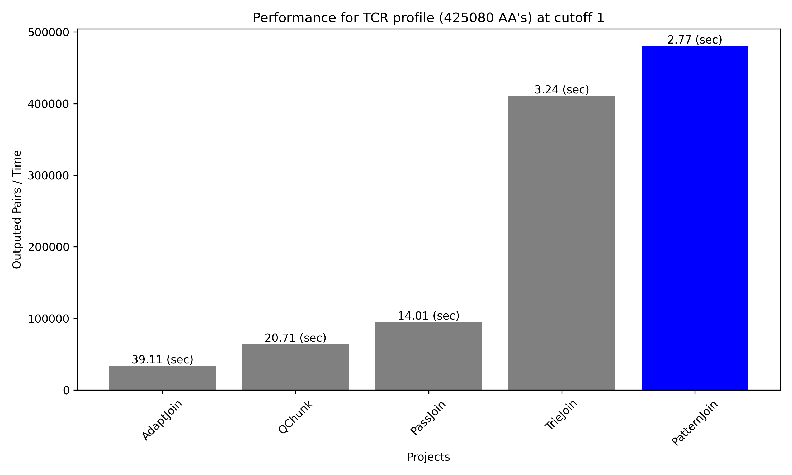
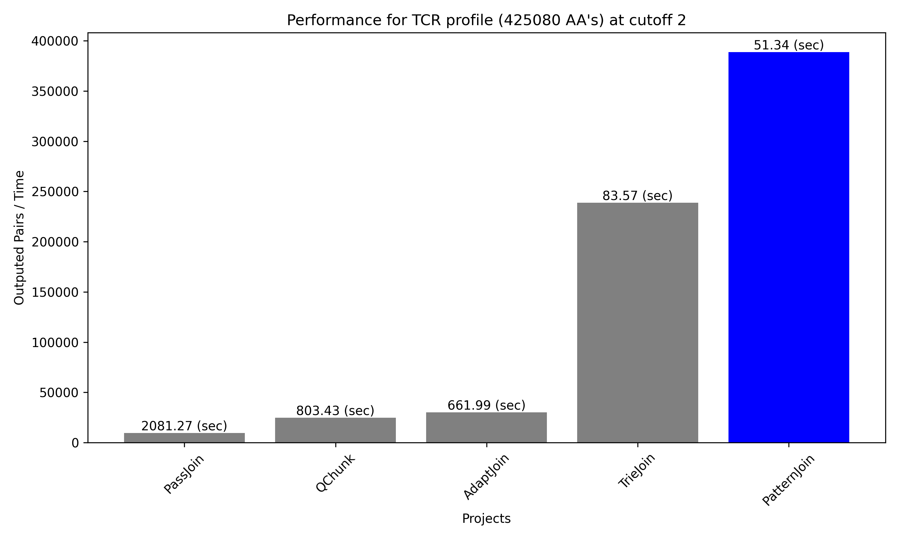
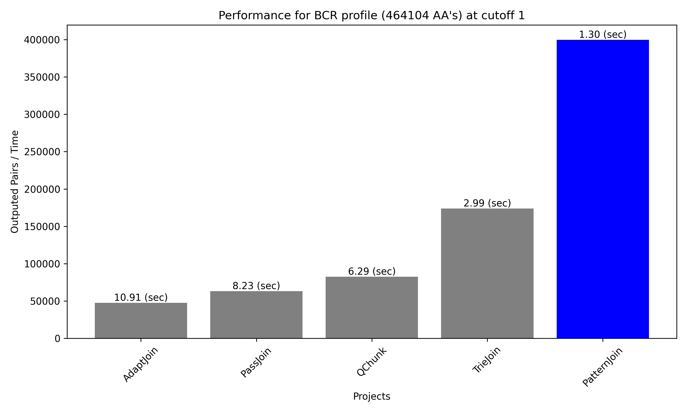
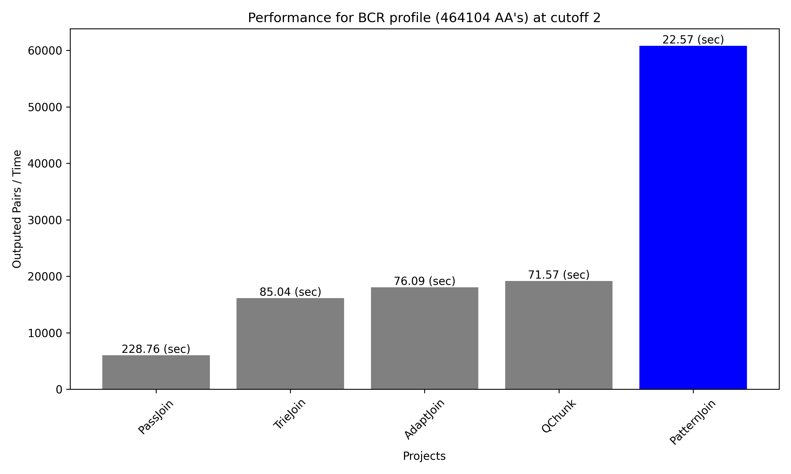

# PatternJoin
This project is a tool for words edit similarity joins (a.k.a. all-pairs similarity search) under small ($< 3$) edit distance constraints. The software is specifically optimized for edit similarity joins of amino-acid sequences from TCR/BCR profiles, where the number of words is relatively large ($10^5-10^6$) and the average length of words is relatively small ($< 20$). 

## What is Edit Similarity Join?
[_Edit distance_](https://en.wikipedia.org/w/index.php?search=Edit+distance&title=Special:Search&ns0=1) between two words is the minimal number of _elementary operations_ needed to transform one word to another. In this project, we consider [_Levenshtein distance_](https://en.wikipedia.org/wiki/Levenshtein_distance) (allows _substitutions_ and _insertions_/_deletions_ of single letters) and [_Hamming distance_](https://en.wikipedia.org/wiki/Hamming_distance) (allows _substitutions_ of any letters and _insertions_/_deletions_ of letters in the end). 

_Edit Similarity Join_ is a specific problem when we have a set of words $X=\\{w_1, w_2, \ldots, w_n\\}$ and we want to find all pairs of 'similar words' $Y_c=\\{(w_i, w_j): distance(w_i, w_j) < c\\}$, where $c \in \mathbb{N}_0$ is called a _cutoff_ parameter.

## Motivation
Let's briefly introduce the problem why this project was originally developed.

### Intro to TCR(BCR) profiles 
__T-cells__ and __B-cells__ are types of white blood immune cells which play a major role in human immunity. On the surface of each T/B-cell we can find receptors (__TCR__/__BCR__) - special molecules that are responsible for recognizing antigens. The collection of all TCRs/BCRs is called __TCR (BCR) profile__. One way to represent an organism's TCR/BCR profile is to collect the genetic sequences of most variable region (CDR3) of each TCR/BCR. Recent research (for instance [[1]](https://www.nature.com/articles/s41467-019-09278-8), [[2]](https://academic.oup.com/bioinformatics/article/36/6/1731/5686386)) shows that it is useful to (1) represent these profiles as graphs with nodes being TCR/BCR and edge weights edit distances between nodes and (2) run some network analysis on these graphs (take a look at the [NAIR](https://github.com/mlizhangx/Network-Analysis-for-Repertoire-Sequencing-) project if you are interested in network analysis in immunology). In order to build these graphs we need efficient edit similarity join software and this is the main purpose of this project.

### Paper
In progress..🧙

## Building
### Build with CMake
From the command line (Windows/macOS/Linux):

```shell
> git clone https://github.com/MatveevDaniil/PatternJoin.git
> cd PatternJoin
> mkdir build
> cd build
> cmake ..
> make
```

## Usage
Assuming you are in the build directory 

### macOS/Linux
```shell
> pattern_join --file_name <..> --cutoff <..> --metric_type <..> --method <..> --include_duplicates <..>
```

### Windows
```shell
> pattern_join.exe --file_name <..> --cutoff <..> --metric_type <..> --method <..> --include_duplicates <..>
```

### Arguments
- `<file_name>`: The path to the input file.
- `<cutoff>`: The edit distance cutoff (`0`, `1` or `2`). If `cutoff` = 0, then the value of `metric_type`, `method` and `include_duplicates` does not matter.
- `<metric_type>`: The edit distance metric (`L` for Levenshtein, `H` for Hamming).
- `<method>`: The core method of edit similarity join (`pattern`, `semi_pattern`, or `partition_pattern`). As default, we recommend using `partition_pattern` as the most memory-efficient while still fast method. For more details take a look to [the paper](#paper).
- `<include_duplicates>`: Consider duplicates in input (`true` or `false`). If `false` the program will ignore duplicate strings in the input and output unique pairs of strings. If `true` program will treat duplicate strings in the input as a pair (index, string) and output pairs of indeces. 

### Input file format
List of words separated by `\n`: `<word_1>\n<word_2>\n...`.

### Output file format
If `include_duplicates = true`: Space-separated pairs of words separated by `\n`: `<word_i> <word_j>\n...`.
If `include_duplicates = false`: Space-separated pairs of indeces separated by `\n`: `<idx_i> <idx_j>\n...`.


## Benchmarks

### Competitors

The performance of PatternJoin project is compared to several state-of-the-art projects for exact edit similarity join. _Exact_ means that we find all pairs with a given edit distance threshold. Several projects such as [VChunk](https://ieeexplore.ieee.org/abstract/document/6185552/?casa_token=zAqsGVomnc4AAAAA:GGe97Nbo3rq-9wMIm8PpkhaORdiupmJW84Vrn6fxNwNCx__9gEMUlDmQDkHVoJTk7Y5cJs8fEQ), [EmbedJoin](https://arxiv.org/abs/1702.00093), [MinJoin](https://dl.acm.org/doi/abs/10.1145/3292500.3330853) and others were excluded due to low recall on tested datasets while not being faster. All compared projects were obtained from original authors (see table below). All tests were done on the same laptop with 16gb RAM and 2.2 GHz CPU.

| Algorithm | Paper | Source code |
|-----------|-------|------|
| QChunk*   | [link](https://dl.acm.org/doi/epdf/10.1145/1989323.1989431) | [link](https://github.com/qinbill/Qchunk) |
| PassJoin  | [link](https://arxiv.org/abs/1111.7171) | [link](https://people.csail.mit.edu/dongdeng/projects/passjoin/index.html) |
| TrieJoin  | [link](https://dl.acm.org/doi/abs/10.14778/1920841.1920992?casa_token=JuyEtjPjmwcAAAAA:CUi9JS3yn6aYXWeQAUKYi5oU5uMhhBX-6xcPibecFmz3A9LubNjrjg5RWr30zWW51I8xZOP_GhNk) | [link](https://www2.cs.sfu.ca/~jnwang/projects/triejoin/) |
| AdaptJoin | [link](https://www2.cs.sfu.ca/~jnwang/papers/sigmod2012-adaptjoin.pdf) | [link](https://www2.cs.sfu.ca/~jnwang/projects/adapt/) |

*Although QChunk algorithm is designed for exact similarity join we noticed that it produce some wrong pairs and ommit some correct pairs of strings. However recall and precision were $>0.99$ in our tests so we decided to keep it. 
### TCR Profile
We obtained [dataset](https://clients.adaptivebiotech.com/pub/Emerson-2017-NatGen) from Cytomegalovirus [research](https://www.nature.com/articles/ng.3822) and took the largest TCR CDR3 Amino Acid profile (TODO: submit data) from it. There are $425080$ sequences in the profile with the average sequence length is $14.6$. Below are speed comparisons for edit distance threshold 1 and 2.

<!-- <div style="display: flex; justify-content: space-between;">
    
    
</div> -->


### BCR Profile
(TODO: introduce data). The number of sequences is $464104$ with the average sequence length $18.7$. Below are speed comparisons for edit distance threshold 1 and 2. 

<!-- <div style="display: flex; justify-content: space-between;">
    
    
</div> -->


## Third-party software
Currently, the project is [using](./thirdparty/) third-party software for hashmap, hashsets, and inlined vectors. 
Hashmaps and hashset are taken from the [ankerl](https://github.com/martinus/unordered_dense) project and inlined vector from [gch](https://github.com/gharveymn/small_vector) project.
You can easily replace any of these containers with any other implementations of hashmap/hashset/vector by changing the corresponding line in [src/hash_containers.h](./src/hash_containers.hpp#L7-L11):
```c++
// src/hash_containers.hpp
using str2int = your_map<std::string, int>;
using ints = your_vector<int>;
using str2ints = your_map<std::string, ints>;
using int_pair_set = your_set<std::pair<int, int>>;
using str_pair_set = your_set<std::pair<std::string, std::string>>
```

## Roadmap
1. Finish documentation.
2. Create R/Python packages.
3. PAPER
4. Cover edit distances $\geq 3$.