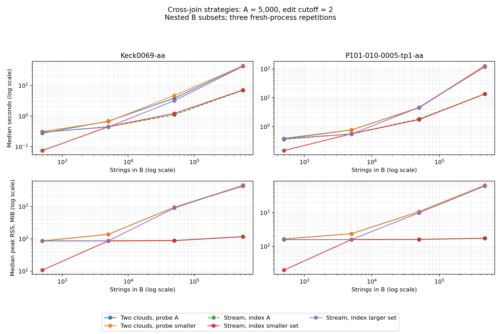

# Cross-join strategy results

Recommendation: generate patterns on demand for the larger set and index the smaller set. This family was consistently faster and used less peak memory in the tested workloads.

All 1,320 independent oracle comparisons passed. All 360 timed runs completed, with matching pair counts and checksums across variants. Each table entry is the median of three fresh processes.

## Full B, with A fixed at 5,000 strings

| Dataset | Cutoff | Variant | Seconds | Peak MiB |
| --- | ---: | --- | ---: | ---: |
| Keck0069-aa | 1 | dual_a | 4.077 | 921.5 |
| Keck0069-aa | 1 | dual_small | 3.685 | 921.6 |
| Keck0069-aa | 1 | stream_a | 0.583 | 38.0 |
| Keck0069-aa | 1 | stream_small | 0.548 | 38.0 |
| Keck0069-aa | 1 | stream_large | 4.082 | 909.2 |
| Keck0069-aa | 2 | dual_a | 43.348 | 4384.1 |
| Keck0069-aa | 2 | dual_small | 43.088 | 4163.7 |
| Keck0069-aa | 2 | stream_a | 6.895 | 115.5 |
| Keck0069-aa | 2 | stream_small | 6.994 | 115.5 |
| Keck0069-aa | 2 | stream_large | 41.194 | 4467.2 |
| P101-010-0005-tp1-aa | 1 | dual_a | 4.389 | 1061.2 |
| P101-010-0005-tp1-aa | 1 | dual_small | 4.317 | 1061.2 |
| P101-010-0005-tp1-aa | 1 | stream_a | 1.125 | 34.3 |
| P101-010-0005-tp1-aa | 1 | stream_small | 1.131 | 34.2 |
| P101-010-0005-tp1-aa | 1 | stream_large | 4.296 | 1052.0 |
| P101-010-0005-tp1-aa | 2 | dual_a | 121.947 | 6475.3 |
| P101-010-0005-tp1-aa | 2 | dual_small | 128.114 | 6574.4 |
| P101-010-0005-tp1-aa | 2 | stream_a | 13.354 | 172.9 |
| P101-010-0005-tp1-aa | 2 | stream_small | 13.465 | 172.8 |
| P101-010-0005-tp1-aa | 2 | stream_large | 116.655 | 6224.5 |

## Scope and interpretation



- Inputs: Keck0069-aa (549,113 unique strings) and P101-010-0005-tp1-aa (469,144). These files are named in the old local comparison script. They differ from the older README counts of 425,080 and 464,104; this is not an exact reproduction of those historical charts.
- B grows through 500, 5,000, 50,000, and the full dataset. A is fixed at 5,000. Additional equal-sized cases have 0% and 50% exact overlap; the nested equal-sized case is A=B. No exact overlap still permits near matches.
- Performance runs use Levenshtein cutoffs 1 and 2. Oracle validation also covers Hamming, duplicate occurrences, empty sets and strings, and swapped sides. Cutoff zero uses the separate exact-match implementation and is not benchmarked here.
- Smaller set means fewer strings; smaller cloud means fewer distinct pattern keys. Very different length distributions or duplicate-heavy inputs could change the tradeoff. Full-size A=B and joins between different biological samples were not measured.
- When A is smaller, stream_a and stream_small execute the same algorithm; when B is smaller, stream_a and stream_large do. All three streaming labels coincide at equal sizes. Differences between equivalent labels are measurement variation.
- Times include cloud construction, probing, verification, result-set construction and cloud destruction. Input reading and result serialization are excluded. Peak RSS includes input strings, clouds and result pairs. It is not cloud memory alone.
- Environment: macOS 15.4, x86_64, Apple clang 15.0.0, `-std=c++20 -O2`. Variants ran sequentially in shuffled order; three repetitions measure local variability, not a guarantee of performance on other machines.
- Production code remains on PR #2. Experiment code and results are reviewed separately in PR #3. See the experiment README for commands and timing details.

The raw runs and summary CSV include min/max timings and memory for inspecting variability. Full pair sets are checked against the small-input oracle; the large-input checksum is a consistency check rather than a mathematical proof of correctness.

Input SHA-256 hashes:

```text
Keck0069-aa
b3b62d2394b81094b9ca2bf089976dbf64535f0e1b64f2fa7064d984a92a110b
P101-010-0005-tp1-aa
1f91c83ac691c5221256702f993952016bad1166e3732a3254238ae42d83cbe0
```

Measured C++ source is from commit `a7f994e`, based on production
commit `02ad1e5`. Use the README command with these inputs in this
order and the default three repetitions to reproduce the sampling.
